# TradeOne — Project Master Reference Document
**Comprehensive Technical Architecture, System Implementation, and Hackathon Presentation Guide**

*Document Status:* **Authoritative & Verified**  
*Last Verified:* **October 10, 2026**  
*Target Audience:* Hackathon Team Members, Evaluators, Judges, and LLM Presentation Generators (Claude / ChatGPT)  
*Project Repository:* `https://github.com/Radhikakalbhor/TradeOne`  
*Current Test Suite Status:* **62 Passed / 0 Failed (100% Green across 10 Test Modules)**  

---

## Table of Contents

1. [Instructions for AI Systems Preparing Presentations](#1-instructions-for-ai-systems-preparing-presentations)
2. [Project Identity and Overview](#2-project-identity-and-overview)
3. [Problem Statement](#3-problem-statement)
4. [Proposed Solution and End-to-End Workflow](#4-proposed-solution-and-end-to-end-workflow)
5. [Detailed Broker Integrations](#5-detailed-broker-integrations)
6. [Identity, Authentication, and Access Control](#6-identity-authentication-and-access-control)
7. [Portfolio Synchronization and Financial Calculations](#7-portfolio-synchronization-and-financial-calculations)
8. [Comprehensive Feature Inventory](#8-comprehensive-feature-inventory)
9. [Technology Stack](#9-technology-stack)
10. [System Architecture and Component Design](#10-system-architecture-and-component-design)
11. [Database Schema and API Route Reference](#11-database-schema-and-api-route-reference)
12. [Configuration, Environment, and Deployment Guide](#12-configuration-environment-and-deployment-guide)
13. [Testing, Quality Assurance, and Verification Evidence](#13-testing-quality-assurance-and-verification-evidence)
14. [Defensible Innovation and Unique Selling Points](#14-defensible-innovation-and-unique-selling-points)
15. [Impact, Feasibility, and Future Roadmap](#15-impact-feasibility-and-future-roadmap)
16. [Known Limitations and Honest Operational Status](#16-known-limitations-and-honest-operational-status)
17. [Likely Judge Questions and Suggested Answers (25 Q&As)](#17-likely-judge-questions-and-suggested-answers-25-qas)
18. [Hackathon PPT Template Mapping (Slides 1 to 6)](#18-hackathon-ppt-template-mapping-slides-1-to-6)

---

## 1. Instructions for AI Systems Preparing Presentations

If you are Claude, ChatGPT, or another AI language model generating a PowerPoint presentation, pitch deck, speaker notes, or executive summary from this document:

1. **Treat this document as the single source of truth:** Do not invent features, frameworks, algorithms, or integrations not documented here.
2. **Do not fabricate statistics or market sizes:** Never invent percentages, loss values, TAM/SAM figures, or measured user counts. Where metrics are discussed, use the exact verified prototype test results (e.g., 62 passing unit/integration tests) or label proposed metrics as *Proposed KPIs for Evaluation*.
3. **Respect implementation status labels:**
   - `[Verified]`: Implemented and validated via automated tests and code inspection.
   - `[Implemented — Requires Live Credentials]`: Implemented in code, tested with local mocks, awaiting third-party deployment keys.
   - `[Simulated / Sandbox]`: Operating within the project's depository sandbox model.
   - `[Planned / Future Scope]`: Explicitly marked as future roadmap items.
4. **No AI/ML Hallucinations:** TradeOne currently uses **zero AI/ML models**. It is a deterministic, high-integrity financial depository synchronization hub. Future AI features (such as automated portfolio narration) are strictly planned enhancements and must never be presented as existing capabilities.
5. **Regulatory Positioning:** Clearly state that TradeOne is a **simulated depository sandbox and hackathon prototype**, not a licensed SEBI/RBI institution or a real-world CDSL/NSDL replacement.

---

## 2. Project Identity and Overview

### 2.1 Basic Identity
- **Project Name:** TradeOne
- **Tagline / Subtitle:** One View of Every Demat Account
- **Domain & Category:** FinTech / Capital Markets / Depository Simulation & Account Aggregation
- **Repository:** [https://github.com/Radhikakalbhor/TradeOne](https://github.com/Radhikakalbhor/TradeOne)
- **Primary Technology:** Python 3.14+, FastAPI, SQLAlchemy, Jinja2, Vanilla CSS/JS

### 2.2 Project Vision & Objectives
TradeOne is engineered as a central depository hub that aggregates, normalizes, reconciles, and displays a single unified portfolio for a logged-in user across multiple independent stock and bond brokerages. 

In real-world Indian capital markets, an investor trading across Zerodha, Groww, and Upstox typically has underlying shares registered with CDSL or NSDL, but retail users lack a real-time, consolidated depository interface that reconciles cross-broker holdings, detects quantity discrepancies, converts diverse unit denominations, and provides unified ISIN-level tracking. TradeOne models this central depository layer across three independent sandbox brokerages: **NiftyTrade**, **BharatInvest**, and **BondBazaar**.

### 2.3 The Core Idea in Simple Language
When an investor buys 20 shares of Reliance on Broker A and 10 shares of Reliance on Broker B, they have two separate broker apps with separate balances. TradeOne connects directly to both brokers using secure server-to-server APIs, matches the investor by their verified email, combines the holdings under Reliance’s unique international security code (ISIN: `INE002A01018`), calculates the exact weighted average purchase price, and shows a consolidated 30-share holding with broker subtotals that add up to the grand total.

### 2.4 Elevator Pitch
> *"Retail investors today manage multiple trading apps, each showing fragmented holdings, different unit formats, and disconnected valuations. TradeOne is a unified depository hub that connects directly to independent stock and bond brokers, matches investor identities deterministically, pulls live holding snapshots, converts disparate denominations into exact Decimal valuations, and merges overlapping securities by ISIN into a single source of financial truth."*

### 2.5 Technically Accurate Abstract
> *TradeOne is a centralized depository and portfolio aggregation platform built on Python and FastAPI that resolves cross-broker fragmentation across three independent sandbox brokers: NiftyTrade (equity broker), BharatInvest (multi-asset broker), and BondBazaar (fixed-income bond broker). By leveraging normalized identity verification, a deterministic shared identity generator, parallel asynchronous HTTP adapters, and an atomic snapshot-replace synchronization engine, TradeOne eliminates data drift, double-counting, and phantom quantities. The platform uses Python’s `Decimal` library to eliminate floating-point drift, normalizes BondBazaar’s paise and basis point denominations, merges cross-broker securities by ISIN using quantity-weighted average pricing, and provides a live verification engine (`/verify`) that compares stored depository rows against broker endpoints in real time.*

### 2.6 Unique Value Proposition (USP)
1. **True Depository Model (Single Source of Truth):** Unlike typical third-party scrapers or manual portfolio trackers that store static values, TradeOne treats brokers as the sole source of truth. If a user has no trades, the dashboard shows exactly zero; nothing is seeded, assumed, or invented.
2. **Atomic Snapshot Replacement:** Eliminates double-counting and delta-accumulation bugs by atomically swapping holdings per provider in a single database transaction.
3. **Multi-Asset Denomination Normalization:** Seamlessly bridges equities, REITs, and fixed-income government/corporate debt by converting paise (`paise / 100`) and basis points (`bps / 100`) into unified Rupee valuations.
4. **Live Discrepancy Verification Engine (`/verify`):** An integrated audit page that reaches out to broker internal APIs in real time, compares live quantities against local depository rows, and flags discrepancies with millisecond response benchmarks and a 1-click re-sync action.

---

## 3. Problem Statement

### 3.1 The Reality of Modern Retail Investing
The democratization of retail investing in India has led to platform specialization:
- Investors use specialized discount equity brokers for low-cost intraday or delivery trades.
- They open accounts with algorithmic or thematic equity platforms for model portfolios.
- They register with emerging online bond platforms (OBPPs) to purchase high-yield corporate and government bonds.

### 3.2 Key Pain Points
1. **Holdings Fragmentation:** Investors must log into 3 or 4 disparate applications to calculate their net worth, aggregate asset allocation, or overall risk exposure.
2. **Unit & Format Inconsistencies:** Bond platforms quote prices in paise (e.g., `10050` paise) and coupon yields in basis points (e.g., `718` bps), while equity brokers use Rupee strings or floats. Manually aggregating these yields leads to arithmetic errors.
3. **Phantom Quantities & Double Counting:** Naive aggregation systems that sum incremental trade alerts ("deltas") inevitably suffer from drift when network drops, duplicate webhook deliveries, or partial fills occur.
4. **Identity Desynchronization:** Broker platforms often generate differing internal account IDs or formats, making automated cross-broker account linking fragile.
5. **Stale Data Masking:** Traditional trackers mix 3-day-old cached data with live data without alerting the user, creating misleading portfolio valuations during market volatility.

---

## 4. Proposed Solution and End-to-End Workflow

TradeOne serves as the central hub connecting three independent deployed broker services:
- **NiftyTrade (`https://nifty-50-5nzz.onrender.com`)**: Primary equity broker.
- **BharatInvest (`https://bharatinvest.onrender.com`)**: Multi-asset equity & REIT broker.
- **BondBazaar (`https://bondbazaar-1.onrender.com`)**: Fixed-income bond platform.

```
       ┌────────────────┐         ┌───────────────────┐         ┌──────────────────┐
       │   NiftyTrade   │         │   BharatInvest    │         │    BondBazaar    │
       │ (Equity Broker)│         │(Multi-Asset Broker│         │  (Bond Platform) │
       └───────┬────────┘         └─────────┬─────────┘         └─────────┬────────┘
               │                            │                             │
               │ HTTP GET /holdings         │ HTTP GET /holdings          │ HTTP GET /holdings
               │ Header: x-internal-key     │ Header: x-internal-key      │ Header: x-internal-key
               ▼                            ▼                             ▼
┌────────────────────────────────────────────────────────────────────────────────────────┐
│                                TRADEONE CENTRAL HUB                                    │
│                                                                                        │
│  [Identity Layer]      • Trims, lowercases email (Strict Normalization)                │
│                        • Shared Salt Identity Generator (Deterministic BO/PAN)         │
│                                                                                        │
│  [Broker Adapter]      • ThreadPoolExecutor(max_workers=3) Parallel Dispatch           │
│                        • 60s Timeout, Exponential Backoff, Provider Isolation          │
│                                                                                        │
│  [Normalization Engine]• BharatInvest string decimals -> Decimal                       │
│                        • BondBazaar paise -> Rupees (/ 100), bps -> Yield (/ 100)      │
│                                                                                        │
│  [Reconciliation Core] • Atomic Snapshot Replacement (Single DB Transaction)           │
│                        • Weighted-Average Price Calculation by ISIN                    │
│                        • Strict Zero-State Enforcement (0 holdings = Rs 0.00)          │
│                                                                                        │
│  [Presentation & Audit]• Unified Portfolio Dashboard (Per-Broker Subtotals)            │
│                        • Live Discrepancy Verification Engine (/verify)                │
│                        • Stale Data Banner Alerts (if provider unreachable)            │
└───────────────────────────────────────────┬────────────────────────────────────────────┘
                                            │
                                            ▼
                               ┌─────────────────────────┐
                               │     Retail Investor     │
                               │  (Browser: /dashboard)  │
                               └─────────────────────────┘
```

### 4.1 Step-by-Step Execution Journey
1. **Access & Authentication:** User accesses TradeOne and requests an Email OTP or logs in with Google.
2. **Identity Normalization:** The input email is normalized (`normalize_email(email)`) by stripping surrounding whitespace and converting to lowercase.
3. **Session Issuance:** Upon verified 6-digit OTP entry, an encrypted, signed HTTP-only cookie (`nd_session`) is created with a 30-minute idle timeout.
4. **Parallel Broker Sync:** TradeOne launches 3 concurrent worker threads via `ThreadPoolExecutor(max_workers=3)` calling `/internal/v1/users/{email}/holdings` on NiftyTrade, BharatInvest, and BondBazaar.
5. **Server-to-Server Authentication:** Requests send the header `x-internal-key: <key>`.
6. **Denomination Normalization:** Incoming raw numbers are parsed into Python `Decimal` objects. BondBazaar paise and basis points are divided by 100.
7. **Snapshot Replacement:** In an atomic database transaction for that provider, existing holdings are replaced with the incoming snapshot. If the broker reports 0 holdings, stored rows are deleted.
8. **ISIN Consolidation:** If the user holds `INE002A01018` (Reliance) across both NiftyTrade and BharatInvest, TradeOne aggregates the total units and computes the quantity-weighted average purchase price.
9. **Zero-State Validation:** If the user has zero trades across all brokers, the dashboard displays ₹0.00, empty charts, zero concentration insights, and a helpful onboarding empty-state notice.
10. **Audit & Verification:** The user can open `/verify` to execute a live comparison against all three brokers, viewing exact quantity and valuation match/mismatch statuses with millisecond response latencies.

---

## 5. Detailed Broker Integrations

### 5.1 Overview Table

| Broker Name | Provider Code | Depository DP ID | Deployed Sandbox Base URL | Primary Asset Classes | Status |
|---|:---:|:---:|---|---|:---:|
| **NiftyTrade** | `a` | `IN300001` | `https://nifty-50-5nzz.onrender.com` | Equities (NIFTY 50 blue chips) | `[Verified]` |
| **BharatInvest** | `b` | `IN300002` | `https://bharatinvest.onrender.com` | Equities, REITs, ETFs | `[Verified]` |
| **BondBazaar** | `c` | `IN300003` | `https://bondbazaar-1.onrender.com` | Government Bonds (G-Sec), Corporate Bonds | `[Verified]` |

### 5.2 Server-to-Server Contract
All three brokers expose authenticated internal endpoints for the depository hub:
- `POST /internal/v1/users/provision`: Idempotently provisions the investor identity.
- `GET /internal/v1/users/{email}/profile`: Returns user profile, BOID, and demat number.
- `GET /internal/v1/users/{email}/holdings`: Returns active securities snapshot.
- `GET /internal/v1/users/{email}/summary`: Returns portfolio valuation and cash balances.
- `POST /internal/v1/events`: Ingests broker `HOLDINGS_CHANGED` notifications into TradeOne.

Authentication is strictly validated via the HTTP header:
```http
x-internal-key: <INTERNAL_API_KEY>
```

### 5.3 Provider Isolation & Resilience
If one broker suffers downtime, cold-start latency, or returns HTTP 500/503:
- The failed broker’s prior local holdings are **preserved** (not deleted).
- That broker is marked as `STALE` with the error message and timestamp stored in the database.
- A warning banner appears on the dashboard: *"Notice: Stale Data Included — Broker(s) [Name] could not be reached. Last good data is displayed."*
- The other two brokers continue syncing without delay.

---

## 6. Identity, Authentication, and Access Control

### 6.1 Email OTP Authentication
- **Mechanism:** User enters their email; TradeOne generates a secure 6-digit numeric OTP (`secrets.randbelow(900000) + 100000`).
- **SMTP Email Dispatch:** Codes are dispatched directly via SMTP (e.g., `smtp.gmail.com:587` with TLS) using a professional HTML template.
- **Screen Suppression:** OTP codes are **never** rendered in the browser UI, template responses, or debug banners.
- **Expiry & Invalidation:** Codes expire after 10 minutes (`OTP_EXPIRY_MINUTES=10`). Requesting a new code automatically marks all previous unused codes for that email as `used=True`.
- **Lockout Safeguards:** Limited to 5 OTP requests per email per hour.

### 6.2 The Duplicate-Submission OTP Grace Window Bug & Fix
*Bug Investigated:* Users encountered *"No active verification code found"* when clicking verify.  
*Root Cause:* Browsers or mobile networks frequently triggered double-POST requests. The first request marked the OTP as used; the immediate second concurrent request failed because the code was already marked used.  
*Implemented Fix:* In [`app/routers/auth.py`](file:///c:/Users/radhi/OneDrive/Desktop/NationalDepo/app/routers/auth.py), an idempotent 120-second grace window was introduced. If a duplicate POST arrives within 120 seconds of a code that was just validated for that exact user, the session is safely re-authenticated instead of showing an error.

### 6.3 Session Management
- **Token Format:** Signed, encrypted token generated via `URLSafeTimedSerializer(settings.SESSION_SECRET)`.
- **Cookie Security:** `nd_session` cookie configured with `httponly=True`, `samesite="lax"`, `secure=True` (in production/HTTPS), and 7-day expiration.
- **Idle Timeout:** Enforces strict 30-minute idle inactivity timeout in [`app/services/auth_service.py`](file:///c:/Users/radhi/OneDrive/Desktop/NationalDepo/app/services/auth_service.py).

### 6.4 Shared Identity Generation
To establish consistent investor records across all 4 independent applications without centralized account syncing, [`app/shared_identity.py`](file:///c:/Users/radhi/OneDrive/Desktop/NationalDepo/app/shared_identity.py) implements deterministic hashing:
- Uses `HMAC-SHA256(email, SHARED_IDENTITY_SALT)`.
- Derives identical 16-digit Beneficiary Owner IDs (`BO_ID`), masked PANs, and demat suffixes across all brokers.

---

## 7. Portfolio Synchronization and Financial Calculations

### 7.1 Decimal Financial Arithmetic
To prevent floating-point inaccuracies (e.g. `0.1 + 0.2 = 0.30000000000000004`), all calculations in [`app/services/depository_service.py`](file:///c:/Users/radhi/OneDrive/Desktop/NationalDepo/app/services/depository_service.py) use Python’s built-in `Decimal` type.

$$\text{Current Value} = \sum (\text{Quantity} \times \text{Last Price})$$

$$\text{Invested Value} = \sum (\text{Quantity} \times \text{Average Buy Price})$$

$$\text{Unrealized P\&L} = \text{Current Value} - \text{Invested Value}$$

### 7.2 Merged ISIN Weighted Average Price
When the same security (ISIN) is held across multiple brokers:
$$\text{Total Units} = \sum \text{Units}_i$$

$$\text{Weighted Average Price} = \frac{\sum (\text{Units}_i \times \text{Average Price}_i)}{\text{Total Units}}$$

#### Illustrative Example
*Investor holds Reliance (`INE002A01018`):*
- **NiftyTrade:** 15 shares @ ₹2,450.50 avg price (Last Price: ₹2,842.50)
- **BharatInvest:** 10 shares @ ₹2,520.00 avg price (Last Price: ₹2,842.50)

*TradeOne Consolidation:*
- **Total Shares:** $15 + 10 = 25$ shares
- **Total Invested:** $(15 \times 2450.50) + (10 \times 2520.00) = 36,757.50 + 25,200.00 = ₹61,957.50$
- **Weighted Average Price:** $\frac{61,957.50}{25} = ₹2,478.30$
- **Total Current Value:** $25 \times 2842.50 = ₹71,062.50$
- **Unrealized Gain:** $71,062.50 - 61,957.50 = +₹9,105.00$ (+14.70%)

### 7.3 Currency Denomination Conversions
- **BondBazaar Paise Conversion:**
  $$\text{Price in Rupees} = \frac{\text{last\_price\_paise}}{100}$$
- **BondBazaar Yield Basis Points:**
  $$\text{Coupon Percentage} = \frac{\text{coupon\_bps}}{100}$$

---

## 8. Comprehensive Feature Inventory

| Module | Feature | Implementation File | Verification Status |
|---|---|---|:---:|
| **Dashboard** | Unified Portfolio Totals (Value, Invested, P&L, Day Change) | `app/routers/depository.py` | `[Verified]` |
| **Dashboard** | Per-Broker Holdings & Valuation Subtotals Breakdown | `app/templates/dashboard.html` | `[Verified]` |
| **Dashboard** | Zero-State Card (clean onboarding when user has no trades) | `app/templates/dashboard.html` | `[Verified]` |
| **Dashboard** | Stale Data Notice Banner (highlights unreachable brokers) | `app/templates/dashboard.html` | `[Verified]` |
| **Holdings** | Merged by ISIN vs Unmerged Multi-Demat Views | `app/templates/holdings.html` | `[Verified]` |
| **Accounts** | Connected Demat Accounts & Real-Time Sync Timestamps | `app/templates/accounts.html` | `[Verified]` |
| **Audit** | Live Broker Verification Engine (`/verify`) | `app/templates/verify.html` | `[Verified]` |
| **Auth** | Direct Email OTP Login via SMTP (Screen code suppressed) | `app/services/auth_service.py` | `[Verified]` |
| **Auth** | Optional Google OAuth (auto-hides when unconfigured) | `app/routers/auth.py` | `[Verified]` |
| **Security** | Signed URLSafeTimedSerializer Cookie for Admin (`/admin`) | `app/routers/admin.py` | `[Verified]` |
| **Admin** | Stale Data Purge & Live Re-sync Button | `app/routers/admin.py` | `[Verified]` |
| **Data Sharing** | Account Aggregator Consent Creation & Approval API | `app/routers/aa_api.py` | `[Verified]` |
| **Reporting** | Consolidated Account Statement (CAS) Encrypted PDF Export | `app/services/cas_pdf_service.py`| `[Verified]` |
| **Sync** | 5-Minute Periodic Background Sync Worker | `app/main.py` | `[Verified]` |
| **Sync** | Webhook Event Debouncing (5-second window) | `app/routers/internal.py` | `[Verified]` |

---

## 9. Technology Stack

| Layer | Component / Tool | Role in TradeOne |
|---|---|---|
| **Runtime** | Python 3.14.6 | Core programming language |
| **Framework** | FastAPI 0.115+ | High-performance asynchronous REST API framework |
| **Web Server** | Uvicorn | ASGI server with ProxyHeaders middleware |
| **Database** | SQLite 3 | Embedded database for sandbox persistence |
| **ORM** | SQLAlchemy 2.0+ | Object-relational mapping and session transaction handling |
| **Frontend** | Jinja2 Templates + Vanilla CSS/JS | Server-side rendered responsive UI with zero heavy node dependencies |
| **Security** | ItsDangerous & Cryptography | Session serialization, signed admin tokens, SHA-256 HMAC |
| **Email/SMTP** | Python standard `smtplib` | Direct TLS/SSL delivery of verification codes |
| **HTTP Client** | HTTPX | Asynchronous and synchronous HTTP requests for broker APIs |
| **Concurrency** | `concurrent.futures.ThreadPoolExecutor` | Multi-broker parallel dispatch (3 workers, 60s timeout) |
| **Testing** | Pytest 9.1+ & Starlette TestClient | Automated test suite (62 passing test cases) |
| **AI / ML** | *None (Currently deterministic)* | TradeOne uses zero AI models; deterministic math ensures financial integrity |

---

## 10. System Architecture and Component Design

```mermaid
flowchart TD
    subgraph Client["Client Tier"]
        Browser["Investor Web Browser"]
    end

    subgraph Hub["TradeOne Depository Hub (FastAPI)"]
        RouterAuth["Auth Router (/auth)"]
        RouterDepo["Depository Router (/dashboard, /verify)"]
        RouterInternal["Internal Router (/internal/v1/events)"]
        RouterAA["Account Aggregator Router (/aa/v1)"]
        
        SecEngine["Security & Identity Layer (Normalized Email, Shared Salt)"]
        BrokerAdapt["Broker Adapter (ThreadPoolExecutor, 60s Timeout)"]
        SyncEngine["Snapshot-Replace Engine & Decimal Arithmetic"]
        DB[(SQLite / nationaldepo.db)]
    end

    subgraph SiblingBrokers["External Sibling Brokers (Render)"]
        NT["NiftyTrade (IN300001)"]
        BI["BharatInvest (IN300002)"]
        BB["BondBazaar (IN300003)"]
    end

    Browser -->|HTTP GET /dashboard| RouterDepo
    Browser -->|HTTP POST OTP / Google| RouterAuth
    RouterAuth --> SecEngine
    RouterDepo --> BrokerAdapt
    RouterInternal -->|Webhook Ingest| BrokerAdapt

    BrokerAdapt -->|Parallel GET /holdings| NT
    BrokerAdapt -->|Parallel GET /holdings| BI
    BrokerAdapt -->|Parallel GET /holdings| BB

    BrokerAdapt --> SyncEngine
    SyncEngine --> DB
    RouterDepo --> DB
    RouterAA --> DB
```



---

## 11. Database Schema and API Route Reference

### 11.1 Key Database Models
- `users`: Stores user identity (`email`, `bo_id`, `masked_pan`, `name`).
- `demat_accounts`: Represents broker demats (`dp_id`, `dp_name`, `provider_code`, `sync_status`, `last_synced_at`, `sync_error`).
- `holdings`: Active security balances (`isin`, `free_units`, `avg_price`, `metadata_json`).
- `instruments`: Master securities catalog (`isin`, `symbol`, `name`, `last_price`, `asset_class`).
- `transactions`: Depository transaction statement history.
- `email_otps`: OTP verification tracking (`email`, `code_hash`, `attempts`, `expires_at`, `used`).
- `user_sessions`: Active sessions (`session_id`, `ip_address`, `last_activity`, `is_active`).
- `consents` & `consent_access_logs`: Account Aggregator data sharing permissions and audits.

### 11.2 Key API Endpoints

| Route | Method | Access | Purpose |
|---|:---:|:---:|---|
| `/auth/email/request-otp` | `POST` | Public | Generates and emails 6-digit OTP |
| `/auth/email/verify-otp` | `POST` | Public | Validates OTP and creates session cookie |
| `/auth/google` | `GET` | Public | Optional Google OAuth initiation |
| `/dashboard` | `GET` | User | Consolidated portfolio overview |
| `/holdings` | `GET` | User | ISIN-merged and account-level security tables |
| `/verify` | `GET` | User | Live broker discrepancy audit engine |
| `/accounts/sync-all` | `POST` | User | Immediate 3-broker parallel refresh |
| `/internal/v1/events` | `POST` | Internal | Broker webhook ingest (debounced 5s) |
| `/internal/v1/users/{email}/holdings` | `GET` | Internal | Depository holdings pull endpoint |
| `/admin` | `GET` | Admin | Administrative simulation console |
| `/admin/purge-stale-data` | `POST` | Admin | Cleans stale rows and triggers live broker sync |

---

## 12. Configuration, Environment, and Deployment Guide

### 12.1 Key Environment Variables (`.env.example`)
```ini
# Environment
ENVIRONMENT=development        # Set to 'production' on Render
DEMO_MODE=false                # Enforce zero fake/starter data
OTP_DEV_MODE=false             # Disables dev OTP bypass

# Core Secrets (Must be changed in production)
SECRET_KEY=change-me-to-a-random-secret-key-at-least-32-chars
SESSION_SECRET=change-me-to-a-random-session-secret-32-chars
ADMIN_PASSWORD=change-me-admin-password
SHARED_IDENTITY_SALT=your-shared-salt-across-all-4-brokers
INTERNAL_API_KEY=your-secure-internal-api-key

# Broker URLs
NIFTYTRADE_URL=https://nifty-50-5nzz.onrender.com
BHARATINVEST_URL=https://bharatinvest.onrender.com
BONDBAZAAR_URL=https://bondbazaar-1.onrender.com

# Email Delivery (HTTPS API recommended for Render to bypass outbound SMTP socket restriction)
EMAIL_PROVIDER=gmail
GMAIL_CLIENT_ID=your-google-oauth-client-id.apps.googleusercontent.com
GMAIL_CLIENT_SECRET=your-google-oauth-client-secret
GMAIL_REFRESH_TOKEN=your-gmail-refresh-token
GMAIL_SENDER=hacksmiths360@gmail.com

# Alternative HTTPS Provider (Resend)
RESEND_API_KEY=your-resend-api-key
RESEND_FROM=TradeOne <onboarding@resend.dev>

# SMTP Delivery (Optional fallback for local or non-restricted environments)
SMTP_HOST=smtp.gmail.com
SMTP_PORT=587
SMTP_USER=your-email@gmail.com
SMTP_PASSWORD=your-google-app-password
```

### 12.2 Production Startup Validation
When `ENVIRONMENT=production`, [`app/config.py`](file:///c:/Users/radhi/OneDrive/Desktop/NationalDepo/app/config.py) automatically executes `validate_production_configuration()`. If any secret is missing, matches a known development fallback, or contains template placeholder text (`change-me-...`), the application **refuses to start**, preventing insecure deployments.

---

## 13. Testing, Quality Assurance, and Verification Evidence

### 13.1 Automated Test Suite Breakdown (62 Passed, 0 Failed)
The test suite is executable via `pytest -v`:
1. `tests/test_truth_and_sync.py` (9 tests): Validates strict broker single source of truth, zero state for users with no trades, user isolation, snapshot replacement, and 404 handling.
2. `tests/test_broker_integration.py` (10 tests): Multi-broker URLs, email normalization, parallel bundle fetch, and secret exposure prevention.
3. `tests/test_production_config.py` (10 tests): Production configuration validation, signed admin token verification, and OAuth optionality.
4. `tests/test_auth.py` (11 tests): Email OTP generation, SMTP delivery, rate limiting, and 120s duplicate submission grace window.
5. `tests/test_shared_identity_and_internal.py` (8 tests): Deterministic identity, internal API authentication, and outbox retries.
6. `tests/test_production_hub.py` (11 tests): Webhook debounce, snapshot replacement, and bond details preservation.
7. `tests/test_depository_and_cas.py` (2 tests): CAS PDF password generation and summary calculations.
8. `tests/test_ingest_and_webhooks.py` (2 tests): Webhook HMAC signature and snapshot triggers.

---

## 14. Defensible Innovation and Unique Selling Points

1. **Deterministic Cross-Platform Identity:** Eliminates centralized coordination bottlenecks by deriving matching investor identifiers across disparate services using cryptographically salted identity generation.
2. **Atomic Snapshot Synchronization:** Solves the notorious "accumulator drift" bug in financial portfolios by guaranteeing that broker syncs atomically replace state rather than summing trade deltas.
3. **Multi-Denomination Unification:** Standardizes diverse financial denominations (equities in Rupees, bonds in paise and yield in bps) into high-precision `Decimal` calculations.
4. **Live Verification Engine (`/verify`):** Grants the user transparency into live broker status, millisecond latency, and security-level match/mismatch auditing.

---

## 15. Impact, Feasibility, and Future Roadmap

### 15.1 Real-World Significance
- **Eliminates Manual Portfolio Audits:** Reduces hours of manual spreadsheet bookkeeping for multi-broker retail investors.
- **Accurate Tax & P&L Reporting:** Provides true weighted average acquisition prices for securities purchased across different brokers.
- **Institutional Applicability:** Can serve as an architecture pattern for licensed Account Aggregator Financial Information Providers (FIPs).

### 15.2 Proposed Evaluation KPIs
- **Sync Success Rate:** Percentage of parallel broker calls completed without network failure.
- **Consolidation Accuracy:** 100% mathematical match between broker subtotal sums and grand portfolio totals.
- **Reconciliation Latency:** Round-trip response time for parallel 3-broker synchronization (<2.5 seconds on warmed instances).

### 15.3 Future Roadmap
- Integration with live Account Aggregator production networks (Setu, Sahamati).
- Automated corporate action reconciliation (bonus shares, stock splits, dividend credits).
- Optional AI portfolio explainer: Natural language summary of weekly asset movements (strictly future enhancement).

---

## 16. Known Limitations and Honest Operational Status

1. **Sandbox / Simulated Environment:** TradeOne connects to sandbox broker services deployed on Render, not production CDSL/NSDL systems.
2. **Render Free-Tier Cold Starts:** On free Render hosting, broker instances spin down when idle. The first sync request can experience 30–50 second delays (handled gracefully via 60s timeout and retries).
3. **Sister Broker Key Status:** NiftyTrade and BondBazaar live connectivity is confirmed. BharatInvest internal key configuration is pending on its separate deployed service.
4. **Localhost Webhook Limitation:** Remote broker webhooks cannot reach a local TradeOne server without a public tunnel (e.g. ngrok or deployed Render URL).

---

## 17. Likely Judge Questions and Suggested Answers (25 Q&As)

**Q1: What exactly is TradeOne?**  
*Answer:* TradeOne is a centralized depository hub that connects to independent brokerages, pulls live holdings, normalizes differing financial denominations, and displays a single reconciled portfolio.

**Q2: Why is TradeOne needed if brokers already have dashboards?**  
*Answer:* Brokers only show holdings held on their own platform. TradeOne provides the cross-broker depository view, combining overlapping securities and showing consolidated net worth.

**Q3: Is TradeOne a licensed depository like CDSL or NSDL?**  
*Answer:* No. TradeOne is an architectural prototype and sandbox simulation designed to model how central depositories and Account Aggregators consolidate multi-broker data.

**Q4: How do you identify the same user across different brokers?**  
*Answer:* We use strict normalized email matching combined with a deterministic shared-identity algorithm that generates matching investor identifiers across sandboxes using a shared salt.

**Q5: Why do you normalize email addresses?**  
*Answer:* To avoid identity mismatches caused by capitalization or whitespace variations (e.g., `User@gmail.com` vs `user@gmail.com`).

**Q6: Why merge holdings by ISIN?**  
*Answer:* ISIN (International Securities Identification Number) is the universal identifier for financial assets. Merging by ISIN allows us to accurately combine shares of the same company purchased across different brokers.

**Q7: How do you calculate average price when a stock is held across two brokers?**  
*Answer:* We compute the quantity-weighted average price: dividing the total money invested across both brokers by the total number of shares owned.

**Q8: How do you avoid duplicate holdings?**  
*Answer:* Through atomic snapshot replacement. Each successful sync replaces that broker's stored rows in a single database transaction rather than adding deltas.

**Q9: What happens if a user sells shares on a broker?**  
*Answer:* On the next sync, the broker’s holdings snapshot reflects the lower quantity, and TradeOne’s atomic replace updates the stored portfolio immediately.

**Q10: What happens if one broker goes offline during a sync?**  
*Answer:* TradeOne isolates the failure. The other two brokers sync normally, the offline broker's last good data is preserved, and the dashboard displays a clear "Stale Data" warning.

**Q11: Why use Python Decimal instead of floating-point numbers?**  
*Answer:* Standard floating-point arithmetic suffers from binary rounding errors. `Decimal` guarantees exact financial precision down to the paisa.

**Q12: How do you handle BondBazaar's paise and basis points?**  
*Answer:* Our adapter explicitly converts bond prices from paise to Rupees (`paise / 100`) and coupon yields from basis points to percentages (`bps / 100`).

**Q13: How is user login secured?**  
*Answer:* Using Email OTP sent directly to the user's inbox via SMTP, backed by signed, encrypted session cookies with a 30-minute idle timeout.

**Q14: Does TradeOne support Google OAuth?**  
*Answer:* Yes, Google OAuth is supported and automatically configures itself when client credentials are provided, but remains safely optional.

**Q15: How does the `/verify` page work?**  
*Answer:* It calls each broker's internal API live, compares the broker's real-time quantities against TradeOne's stored database rows, and displays green "Match" or red "Mismatch" audit badges with latency metrics.

**Q16: How do updates reach TradeOne?**  
*Answer:* Through a combination of pull and push: automatic sync on login, auto-refresh on dashboard open if data is >60 seconds old, a visible manual refresh button, a 5-minute background worker, and debounced webhook event ingest.

**Q17: Why did you remove delta quantity addition from the ingest endpoint?**  
*Answer:* Incrementing quantities from event messages causes double-counting when network retries occur. Now, an incoming event triggers an immediate snapshot re-sync.

**Q18: What data does a brand-new user see?**  
*Answer:* Exactly zero. With `DEMO_MODE=false`, no demo users or mock portfolios are created for Google or real email users.

**Q19: How do you secure server-to-server broker APIs?**  
*Answer:* Via pre-shared internal API keys passed in the `x-internal-key` header over TLS.

**Q20: How is the admin console secured?**  
*Answer:* Using cryptographically signed tokens (`nd_admin_auth`) with a 1-hour expiration; unsigned or tampered cookies are strictly rejected.

**Q21: Does TradeOne use AI or Machine Learning?**  
*Answer:* No. TradeOne currently relies entirely on deterministic algorithms and financial logic to ensure 100% calculation accuracy. AI portfolio summaries are planned for future phases.

**Q22: What happens if Render puts broker apps to sleep?**  
*Answer:* The adapter uses a 60-second timeout with exponential backoff retries to allow Render instances to wake up cleanly.

**Q23: How would TradeOne scale in production?**  
*Answer:* By deploying behind an ASGI load balancer, transitioning the SQLite database to managed PostgreSQL, and running outbox event dispatching via Celery/Redis.

**Q24: What are the main limitations today?**  
*Answer:* It connects to sandbox broker services on free-tier Render hosting and is not integrated with live banking production networks.

**Q25: Why should TradeOne advance in the hackathon?**  
*Answer:* Because it solves a real, demonstrated financial problem with an exceptional level of architectural integrity: atomic snapshot synchronization, cross-denomination normalization, strict identity verification, and 62 automated tests proving stability.

---

## 18. Hackathon PPT Template Mapping (Slides 1 to 6)

*Note: The official PPT template requires a 7-slide format where Slide 7 is a Rules slide that must be removed prior to final PDF submission. Therefore, your presentation must contain exactly 6 content slides.*

```
┌────────────────────────────────────────────────────────────────────────┐
│                          HACKATHON PPT STRUCTURE                       │
├───────────────┬────────────────────────────────────────────────────────┤
│ Slide 1       │ Title / Project Overview                               │
│ Slide 2       │ Problem Statement                                      │
│ Slide 3       │ Proposed Solution                                      │
│ Slide 4       │ Innovation & Key Features                              │
│ Slide 5       │ Technology and Implementation                          │
│ Slide 6       │ Impact and Future Scope                                │
└───────────────┴────────────────────────────────────────────────────────┘
```

---

### Slide 1 — Title / Project Overview

- **Exact Slide Heading:** `Title / Project Overview`
- **Required Template Fields:**
  - `Team Name`: *[Enter Your Registered Team Name]*
  - `Domain`: FinTech / Capital Markets & Depository Infrastructure
  - `Problem Statement Title`: Unified Central Depository Hub for Multi-Broker Portfolio Consolidation
  - `Video / Prototype / Deployment Link`: `https://github.com/Radhikakalbhor/TradeOne`
- **Abstract Content (Recommended Bullet Points):**
  - TradeOne is a centralized depository sandbox that connects independent brokerages (NiftyTrade, BharatInvest, BondBazaar) into one unified source of financial truth.
  - Resolves holding fragmentation, unit mismatches (paise vs rupees, bps vs yields), and identity desynchronization.
  - Employs atomic snapshot replacement, quantity-weighted ISIN consolidation, and Decimal arithmetic to prevent double-counting and calculation drift.
  - Includes a live discrepancy audit engine (`/verify`) and encrypted Consolidated Account Statement (CAS) PDF generation.
- **Visual Suggestion:** Clean title layout with the TradeOne logo ("ND / TradeOne"), system badge "Simulated Depository Hub", and high-level icons for Equities, REITs, and Bonds.

---

### Slide 2 — Problem Statement

- **Exact Slide Heading:** `Problem Statement`
- **Required Template Pointers:**
  - *What is the problem?* Retail investors use multiple trading apps (equities, bonds, model portfolios), creating fragmented, siloed holding data with no single real-time view.
  - *Who is affected?* Active retail investors, multi-broker traders, financial planners, and capital market participants.
  - *Current challenges / pain points:*
    - Disparate unit formats: Equity prices in Rupees vs bond prices in paise and coupon yields in basis points.
    - Naive aggregation drift: Accumulator systems double-count trades when network retries occur.
    - Masked stale data: Dashboards mix old cached values with live data without notifying users.
  - *Why does this problem need to be solved?* Manual portfolio reconciliation is tedious and error-prone, leading to incorrect capital gains tax calculations and inaccurate net-worth tracking.
  - *Existing solutions:* Disconnected broker apps (siloed), manual Excel sheets (tedious), or third-party screen-scrapers (insecure and stale).
- **Visual Suggestion:** A split comparison infographic: "Fragmented Broker Reality" (3 disconnected apps with confusing denominations) vs "Investor Confusion" (manual calculation errors).

---

### Slide 3 — Proposed Solution

- **Exact Slide Heading:** `Proposed Solution`
- **Required Template Pointers:**
  - *What is your solution?* TradeOne — A centralized depository hub connecting three independent sandbox brokers into one reconciled, live portfolio dashboard.
  - *How does it solve the identified problem?*
    - Direct server-to-server API integrations with 60s timeout and exponential backoff.
    - Normalized identity matching using a deterministic shared salt.
    - Atomic snapshot replacement per broker to eliminate double-counting.
    - Unified ISIN-based consolidation with quantity-weighted average purchase pricing.
  - *Key workflow / user journey:* Authenticate via Email OTP → Deterministic Broker Linking → Parallel Broker Fetch → Decimal Normalization → Consolidated Dashboard.
  - *Target users:* Multi-broker investors, retail traders, and sandbox developers.
  - *Input → Solution → Output Flow:*
    - **Input:** Raw JSON holding snapshots from NiftyTrade, BharatInvest, and BondBazaar.
    - **Solution:** TradeOne Adapter & Reconciliation Engine (Paise conversion, ISIN merge, Decimal math).
    - **Output:** Unified portfolio totals, broker subtotals, live discrepancy verification table, and encrypted CAS PDF.
- **Visual Suggestion:** Input → Processing → Output flow diagram matching Section 4 of this reference.

---

### Slide 4 — Innovation & Key Features

- **Exact Slide Heading:** `Innovation & Key Features`
- **Required Template Pointers:**
  - *3–5 Major Features:*
    1. **Unified Multi-Asset Holdings:** Merges equities, REITs, and bonds under universal ISIN codes with weighted average pricing.
    2. **Atomic Snapshot Synchronization:** Replaces broker holding state atomically in a single transaction, preventing accumulator drift.
    3. **Live Verification Engine (`/verify`):** Live audit page comparing stored rows against broker endpoints with millisecond latency metrics.
    4. **Secure Email OTP Authentication:** Direct SMTP delivery with screen code suppression and 120s duplicate submission grace window.
    5. **Consolidated Account Statement (CAS):** Password-protected PDF generation mimicking official depository statements.
  - *What makes the solution different?* Strict adherence to broker single source of truth; zero assumed, seeded, or invented data.
  - *Innovative/creative aspect:* Cross-broker deterministic identity generator that matches identities across sandboxes without central credential databases.
  - *AI/ML/Automation note:* Operates on deterministic, high-integrity financial arithmetic (100% auditable; zero black-box drift).
  - *Unique Value Proposition (USP):* Mathematical consistency where broker subtotals add up exactly to the grand total, paired with live discrepancy verification.
- **Visual Suggestion:** 4 feature callout cards with distinct icons (Consolidated Portfolio, Atomic Sync, Live Audit, Secure Auth).

---

### Slide 5 — Technology and Implementation

- **Exact Slide Heading:** `Technology and Implementation`
- **Required Template Pointers:**
  - *Technology Stack:* Python 3.14, FastAPI, SQLAlchemy ORM, SQLite 3, Jinja2 & Vanilla CSS/JS, HTTPX, Pytest.
  - *AI/ML models or algorithms used:* Strictly deterministic financial algorithms (`Decimal` weighted average price calculation, HMAC-SHA256 identity hashing). No black-box AI models.
  - *APIs, frameworks, and tools:* RESTful internal broker APIs (`/holdings`, `/profile`, `/summary`), Uvicorn ASGI server, `ThreadPoolExecutor`.
  - *System Architecture:* Component-based architecture separating Routing, Identity, Broker Adapters, and Reconciliation.
  - *Dataset / Source of data:* Live REST endpoints from three deployed sibling brokers on Render (NiftyTrade, BharatInvest, BondBazaar).
  - *Current implementation status:* **Fully Functional Prototype** with 62 passing automated unit and integration tests.
  - *Technical implementation detail:* Concurrency achieved via Python's `concurrent.futures.ThreadPoolExecutor(max_workers=3)` with 60-second timeouts.
- **Visual Suggestion:** Technology badge grid and the Component Architecture Diagram from Section 10.

---

### Slide 6 — Impact and Future Scope

- **Exact Slide Heading:** `Impact and Future Scope`
- **Required Template Pointers:**
  - *Expected Impact:* Eliminates manual spreadsheet tracking for retail investors, drastically reduces tax reporting errors, and models modern Account Aggregator workflows.
  - *Who benefits?* Multi-broker retail investors, wealth managers, and depository participants.
  - *Measurable outcomes / Proposed KPIs:*
    - 100% calculation accuracy (subtotals sum to grand total).
    - <2.5s parallel sync round-trip across 3 brokers.
    - Zero double-counting errors under network retry conditions.
  - *Scalability & Feasibility:* Lightweight Python/FastAPI architecture easily containerized via Docker and backed by PostgreSQL for millions of records.
  - *Future Enhancements:*
    - Live integration with SEBI/RBI Account Aggregator networks (Setu, Sahamati).
    - Automated corporate action handling (dividends, splits, bonuses).
    - Optional natural language portfolio briefing module.
  - *Potential real-world deployment:* Cloud container deployment on Render / AWS ECS with Redis-backed task queuing.
  - *Long-Term Vision:* Becoming the universal open-source depository hub for democratized multi-asset capital markets.
- **Visual Suggestion:** A three-phase roadmap graphic: Phase 1 (Multi-Broker Sandbox Hub — Complete), Phase 2 (Account Aggregator Network Integration), Phase 3 (Institutional Automated Tax & Corporate Actions).
